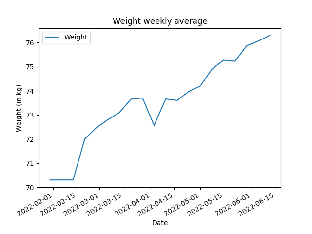

# Weight Tracking and Forecasting Project
Start of a project where I *attempt* to use MyFitnessPal's API to retrieve my user data and process it in some way (TBD).

## TODO
- Find a way to retrieve data from MyFitnessPal storage. Currently, an API key must be requested from API team before access to logged data can be obtained.
- Process for time-series forecasting (GPR?)

## Weight Data (as of 2022/06/06)

### Weekly difference
| Date                |      Weight |
|:--------------------|------------:|
| 2022-01-30 00:00:00 | nan         |
| 2022-02-13 00:00:00 |   0         |
| 2022-02-20 00:00:00 |   1.7       |
| 2022-02-27 00:00:00 |   0.466667  |
| 2022-03-06 00:00:00 |   0.333333  |
| 2022-03-13 00:00:00 |   0.3       |
| 2022-03-20 00:00:00 |   0.55      |
| 2022-03-27 00:00:00 |   0.05      |
| 2022-04-03 00:00:00 |  -1.14      |
| 2022-04-10 00:00:00 |   1.1       |
| 2022-04-17 00:00:00 |  -0.06      |
| 2022-04-24 00:00:00 |   0.375     |
| 2022-05-01 00:00:00 |   0.225     |
| 2022-05-08 00:00:00 |   0.7       |
| 2022-05-15 00:00:00 |   0.366667  |
| 2022-05-22 00:00:00 |  -0.0416667 |
| 2022-05-29 00:00:00 |   0.641667  |
| 2022-06-05 00:00:00 |   0.193333  |
| 2022-06-12 00:00:00 |   0.24      |

### Average Weight per week

